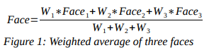
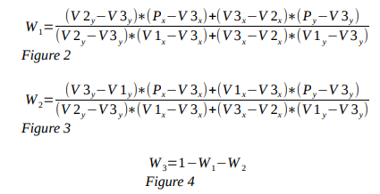
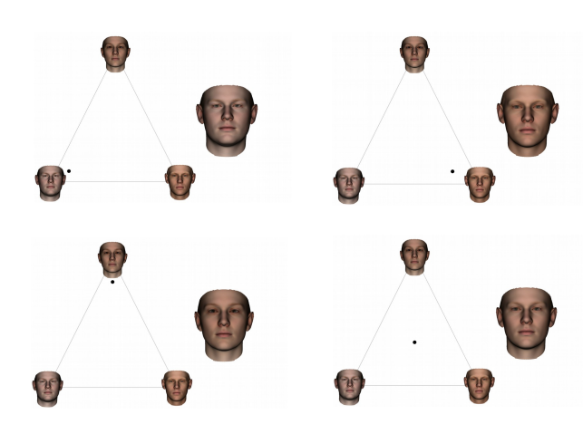
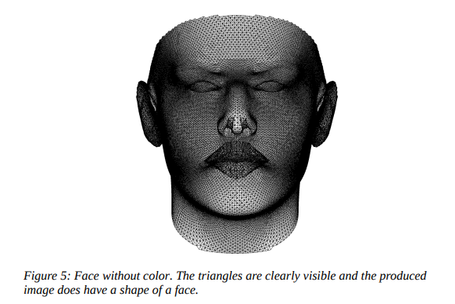
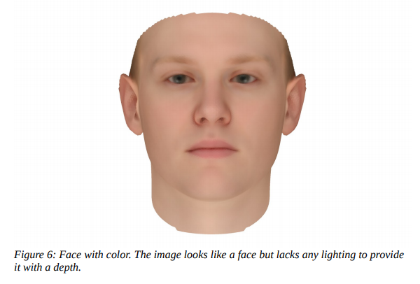
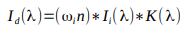
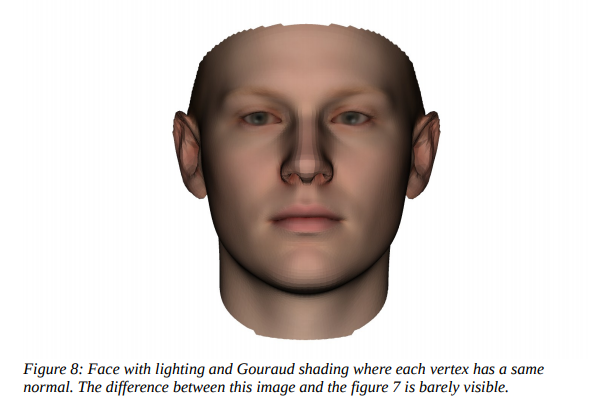
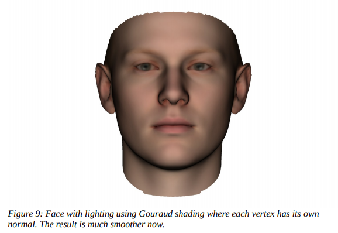

# Face Rendering
## Overview
### Basic Specification
Assignment of the practical is to implement a Java application to model 3D faces based on provided
csv files. In particular, a triangle should be displayed in the screen where each of its vertices
represent a face provided in the csv files. The user should be able to click anywhere in the triangle
and a new synthetic face should be generated by combining the three faces. The synthetic face is
result of interpolation between shapes and colors of the three faces based on the clicked position.
The project uses orthographical projection and single direction light source aligned with the
viewing direction. Both flat shading and Gouraud shading is utilized and compared.

## Running
The jar file is in out/artifacts/ folder and can be run by this command:  
`java -jar CS4102Practical2.jar <source_path>`  
where the source_path argument points to the directory with face files. The face files are hardcoded
into the program. To build the application from scratch, following jar files from `processing-
<version>/core/library/` have to be included as libraries:
- `core.jar`
- `gluegen-rt.jar`
- `jogl-all.jar`

## Design and Implementation
### Generating Faces
One of the main aims of the design was to write a modular code in order to easily provide
extensions for the basic assignment. Therefore, face shape and face texture is stored in the Face
class, but the faces are actually generated through a `FaceFactory` object. To initialise, the object
requires file paths to:
- mesh file
- file holding positions of vertices for average face
- file holding colors of vertices for average face
- file holding weights of each face shape
- file holding weights of each face color

This data is loaded into memory as it is required for generation of each face. New faces are obtained
by adding offsets of positions and colors to the data loaded into the factory object. These offsets are
contained in face files larger than 000. Before addition, these offsets are multiplied by weights in
the `sh_ev.csv` and `tx_ev.csv` files. The weights also provide an easy way to tweak the impact of each
face on the resulting synthetic face. The factory design pattern lands well to program logic of
generating new objects based on some predetermined data.  

To create a new synthetic face, the three faces on vertices are added together in a weighted average
based on mouse position in the interactive triangle. The weights obtained from the `sh_ev.csv` and
`tx_ev.csv` files are first multiplied by a number between 0 and 1 for each of the three faces, such that
these three numbers sum up to 1. These three numbers are used as weights for the weighted average
of all three faces as shown below:
  
A naive solution to this task would be to calculate weights by their distance from each vertex.
However, a desired property of the triangle is to only interpolate between 2 faces when selecting
points on edge, hence weight of face on opposite vertex is equal to 0. Such property is not satisfied
when using the previously defined logic, but is satisfied by Barycentric weights. These weights are
acquired by the following formula:  
  
where V1, V2 and V3 are the three vertices of the triangle and P is the clicked position. For
example, suppose a triangle where vertices V2 and V3 share a same y-coordinate, hence they are in
the same height. The point P is only slided on the edge between these two vertices, therefore it
shares the y-coordinate as well. Since V2Y and V3y are equal, and Py and V3y are equal, the weight
W1 equals to 0. Hence, the desired property is satisfied by this formula.
Whenever the user clicks somewhere within the triangle, the Barycentric weights are calculated
based on the position of mouse, and then they are used to calculate the weighted average as shown
in the figure 1. The examples of the application are shown in following figures.  
  
To speed up performance of the application, a static boolean variable called DISPLAY_FACES can
be changed to false. This option omits faces on the vertices.

### Displaying Faces
Data for shape and texture of faces is stored as a list of Triangle objects where each Triangle object
holds positions and colors of its three vertices. To display the shape, the painter algorithm is
utilized. The algorithm paints the triangles based on distance from the viewing point and starts by
painting the furthermost triangles. The algorithm is not effective for real-time projections, but it
suffices for projection of a single face, that does not require a large number of triangles. To
implement the algorithm, the triangles are simply sorted based on z-coordinate of their central point,
and then iteratively painted starting from the first point. Following figure demonstrates a face’s
shape without texture:  
  
The next step is to apply the color. Simple model can generate an average color based on color of its
three vertices, used it for the whole triangle. Following figure demonstrates that:
  

To provide depth to the face, a lighting is required. This project uses Lambert’s illumination model
which is given by folloing formula:  
  
where Id(λ) is the intensity of reflected light at wawelength λ, ωi is the vector for incoming light, n
is normalized normal of point, where the light hits the surface, Ii(λ) is the intensity of the incoming
light at wawelength λ and K(λ) is diffuse coefficient at wawelength λ.
Since we’re using directional light, the input vector is same for each triangle, and so it the light
intensity and diffuse coefficient. The normal is the only variable that changes in this formula for the
face displaying. The normal of triangle is calculated as cross product of two vectors defined by
three vertices of the triangle. If the reflectance is calculated using normal of each triangle and flat
shading is used for coloring of the triangle, face produced by such method is displayed in the figure
below.
  
To improve on this, Gouraud shading is used. Gouraud shading computes color at vertices of a
surface and interpolates the colors on vertices throughout surface. The first version of Gouraud
shading for this project simply used normal of triangle as normal for each of its vertices. The result
of such method is displayed below.
  
Final step is to calculate normal of each vertex as addition of normals for each triangle it is part of.
Such normal provides the average normal of vertex, based on surfaces it is part of. To implement
this in the code, first a map of points to triangles is generated. This data structure keeps vertices as
keys, and a set of triangles it is part of as the values. From this structure, a new map is generated
each time a new face is generated. This map takes the previous map, and assigns normal to each of
the vertices. The normal is calculated from the triangles that are values in the previous map. This
calulation has to be done every time, because the shape of new face can change, and with it the
normals of each triangle. The result of this approach is displayed in the figure below.
  
To understand implementation more thoroughly, the code is well commented using JavaDoc and
comments in methods.

## Conclusion
The application generates synthetic faces as a weighted average of three faces. The interactive triangle
along with the faces on its vertices is displayed on the screen. Performance of the application can
definitely be improved, nevertheless, faces displayed by the application are smooth thanks to
Gouraud shading and calculation of normals for each vertex separately. The choices made
throughout the project are justified by the report, along with progress made by each new step. I
dont’provide unit testing, however, I consider the functionality displayed by the application to be at
least a partial testing. The most difficult part of the project was to calculate normals for each vertex
separately. Given more time, I’d provide thorough unit testing and improve performance of my the
algorithm where possible.
Figure 9: Face with lighting using Gouraud shading where each vertex has its own
normal. The result is much smoother now.